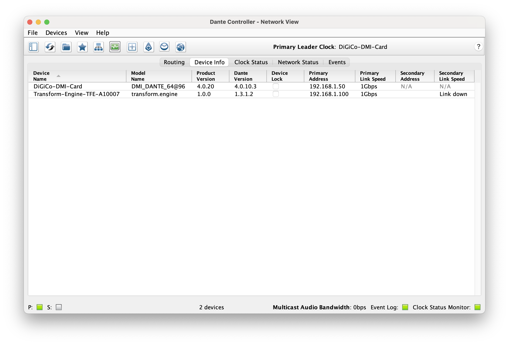
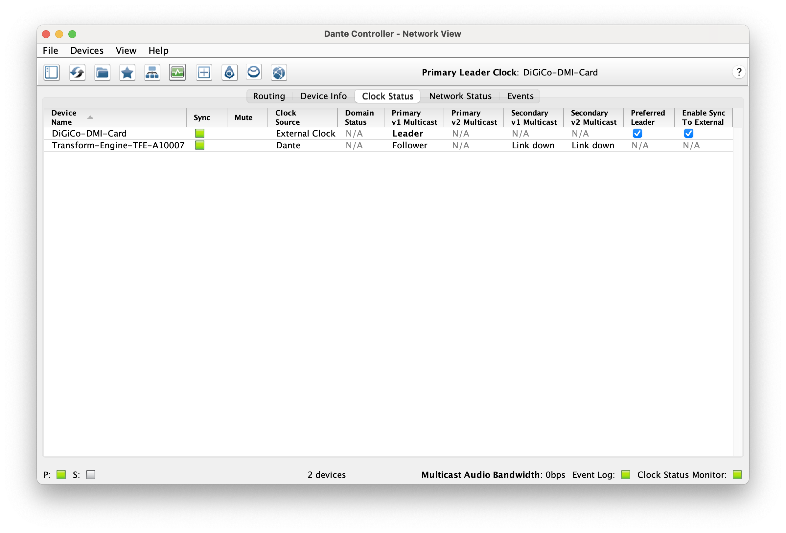

import ReactPlayer from 'react-player'

# Getting Started

So you've just got your hands on a **transform**.engine - congratulations!!

Now, let's get you up and running. 

:::info

This page will hopefully get you up and running as soon as possible, we've kept it lean on purpose. For more detailed information regarding all things **transform**.engine, please take a deep dive into our manual, which you can find in the sidebar on the left.

:::

# Step 1: Unpack the cardboard box

The fun bit! Carefully unpack your **transform**.engine from the box. In the box, you will find:

- a **transform**.engine
- an IEC power lead
- a safety information document

If you are missing any of the above - please get in touch with your supplier and they will be able to help.
Be sure to read diligently the important information in the safety instructions!

# Step 2: Plug it in

Start by plugging in the network connections to a Dante network. To see some of the various options for network configuration, check out our handy manual page [here](installation/dante-network-examples.md).

Next, take your IEC cable and plug it into the **transform**.engine, and turn the power switch on.
Wait for the engine to start: this may take a couple of minutes.

# Step 3: Configure the IP address(es) of the **transform**.engine

For the purposes of this getting started guide, we will assume it is a fairly simple setup, consisting of 1x **transform**.engine, 1x Dante enabled audio mixing console, and 1x personal computer to run the **transform**.client on.

Using the screen on the front of the **transform**.engine and the encoder, press the encoder once to enter the menu, and then select 'IP Config'.

From there, you are able to set your desired IP Address configuration. 

:::info

Please bear in mind, we will use example IP addresses below, but please configure the IP addresses as you need.

:::

## Example **transform**.engine IP addresses:

### Primary
Mode: **Static**  
IP: **192.168.1.100**  
Subnet Prefix: **/24**  (equivalent to  255.255.255.0)    
Gateway: **N/A**  

### Secondary  (optional)
Mode: **Static**  
IP: **192.168.2.100**  
Subnet Prefix: **/24**  (equivalent to  255.255.255.0)     
Gateway: **N/A**  

### Control
Mode: **Static**  
IP: **192.168.3.100**  
Subnet Prefix: **/24**  (equivalent to  255.255.255.0)   
Gateway: **N/A**  

## Example Dante enabled audio mixing console IP addresses

:::tip

 In a Digico environment, this would be the IP address of your DMI-Dante card, not your console ethernet port!

 :::

### Primary-
Mode: **Static**  
IP: **192.168.1.50**  
Subnet: **255.255.255.0** (equivalent to  /24)  
Gateway: **N/A**  

### Secondary (optional)-
Mode: **Static**  
IP: **192.168.2.50**  
Subnet: **255.255.255.0** (equivalent to  /24)    
Gateway: **N/A**  

### Example Personal Computer (wired connection) IP address
Mode: **Static**  
IP: **192.168.1.200** (this is for Dante patching and will change when connecting through the **transform**.client)  
Subnet: **255.255.255.0**  (equivalent to  /24)  
Gateway: **N/A**

:::info

In order for the audio engine to start (enabling you to install, open and plugins), the 'Primary' network socket must be connected to another device, and show a green light on the back of the unit.

:::

:::warning

Please note that at this time, the **transform**.client must be connected by either a static or DHCP IP address - **not link-local**; see [known issue TF-1686](known-issues.md).
This will be resolved in a future release.

:::

# Step 4: Dante Patching and Clocking

### Patching

At this point, we need to patch the Dante subscriptions between your **transform**.engine and audio console. 

Plug the primary port of your **transform**.engine, the primary port of your Dante enabled audio console, and your personal computer all into a network switch. 

If you haven’t already, download Dante Controller [here](https://my.audinate.com/support/downloads/dante-controller) and install it onto your personal computer.

Launch Dante Controller, your **transform**.engine and audio console will magically appear! 

Patch all 64 transmits (_fancy networing term for outputs_) from one device to the other device’s receives (_similarly fancy networking term for inputs_), and vice versa. 

Your devices will now be patched 1 to 1! 

### Clocking

Whilst Dante is very clever, ensuring your clock settings are correct are vital for crystal clear audio.

Dante will automatically select a clock leader, but if for example you are using a Digico console, and the console is set to anything other than the DMI-Dante card as the sync primary. You will need to ensure your DMI-Dante card takes it's sync from the console. To do this, in Dante controller, in clock status, you need to tick the 'Preferred Leader' box and 'Enable Sync to External' on your DMI-Dante card.

This means your Dante network will be clocking from your console sync. If you don't do this, your console and Dante network will be running to different clocks and could lead to potential problems! 

Once patching and clocking is done, unplug the **transform**.engine, audio console and personal computer from the network switch. Plug the primary connection directly from **transform**.engine to the primary port of the  audio console (do the same for secondary if in use). 

We are now ready for audio, let’s prep **transform**.client! 

# Step 5: Setting up **transform**.client software

Download **transform**.client from our website [here](../downloads/index.md), and install it to your device. 

:::info

**Klaxon**: the **transform**.client has the associated **transform**.engine firmware bundled into the software, hence you don’t need an additional firmware file. Wherever your **transform**.client software goes, the relevant firmware will be there too!

:::

With your audio connections now patched and connected, plug a cable from the control port of the **transform**.engine to your personal computer. You will then need to edit the IP settings of your personal computer.

### Current Personal Computer IP settings:
Mode: Static
IP: 192.168.1.200  (this was for Dante patching)
Subnet: 255.255.255.0  (equivalent to  /24)

### New Personal Computer IP Settings:
Mode: Static
IP: 192.168.3.200
Subnet: 255.255.255.0  (equivalent to  /24)

Your personal computer and the control port of the **transform**.engine are now on the same subnet and will be able to talk to one another! 

Launch **transform**.client! You’ll be presented with a window like this:

Select ‘Connect to new device’ and enter the IP address (in this case 192.168.3.100), hit enter, and voila! 

Your **transform**.engine has been found, click the device and you’ll be ready to enter the new world of plugins, live.

Now for the really exciting bit. Getting going!!

Here's Elliot giving you a quick spin through the **transform**.client:

<ReactPlayer controls url="https://www.youtube.com/watch?v=4sT_dBsWTvc" />

# Step 6 (Potentially): Updating your **transform**.engine!

If your **transform**.engine is on the correct version already, you can skip straight to Step 7, or we’d recommend a quick tea break, a bike ride, and/ or learn to juggle.

However, if your **transform**.engine is on a different version to your **transform**.client, you will be forced to take action! 

:::info

**Second klaxon** (and friendly reminder): the **transform**.client has the associated **transform**.engine firmware bundled into the software, hence you don’t need an extra file. Wherever your **transform**.client software goes, the relevant firmware will be there too! 

When the **transform**.engine and **transform**.client are on incompatible versions, when selecting your **transform**.engine in the  **transform**.client, it will launch directly to the ‘Software’ tab, do not pass go, do not collect $200. 

At this point you will see the message ‘Upgrade to ??.??.?? (required)’ and you will be unable to do anything else. Select upgrade and it will do its thing, once finished, you’ll be prompted to restart and your **transform**.engine will be firing on all cylinders in no time. This will ensure maximum performance and compatibility! 

If you have any problems when upgrading - please don't hesitate to drop us an email at support@fourieraudio.com and we'll get back to you ASAP.

:::

# Step 7: Installing Plugins

Now it's time to install your plugins!

Here's Elliot talking you through plugin installation.

<ReactPlayer controls url="https://www.youtube.com/watch?v=wM6M_uJXXxI" />

To install plugins and licence some plugins on your **transform**.engine, you will need to install them in the virtual Windows 10 environment.

We will  use a SSL plugin as  example below, we also have a range of walk through guides to installation and licensing on our website from various manufacturers, [here](https://docs.fourieraudio.com/manual/**transform**.client/library/plugins/manufacturers/).

### Accessing Windows Environment

1. Open the Fourier Audio Transform client software. 
2. Select the **transform**.engine you would like to install the plugins onto.
3. Once open, click the ‘Library’ tab, and select ‘Add/Remove Plugins’.
4. A warning message will appear ‘This will stop the audio engine, are you sure you want to continue?’. If happy to proceed, select ‘Continue to Add/Remove Plugins’.
5. Your installed plugins will appear in the list, to add more, select ‘Open plugin host’, this will take you to the virtualized Windows 10 environment.

Once into the Windows 10 environment, install plugins as you normally would on any Windows 10 system. Example of an SSL plugin below:

1. After following the ‘Accessing Windows Environment’, you will be in a position to install plugins.
2. On your personal device, download the desired plugin(s) for a Windows OS from the above link, it should be in a `.exe` file format.
3. Copy this installer file to a USB stick.
4. Plug it into any of the USB ports on the **transform**.engine.
5. In the search bar, type ‘This PC’, it will find the ‘This PC’ app and hit enter.
6. Locate your USB stick in the window and find your SSL installer file.
7. Run the Application (`.exe` file) for the desired plugin.
8. During the installation process, when asked which components to install, unselect AAX and VST.
9. Install location does not need to be altered.
10. Navigate through each menu, and once complete, click ‘Finish’.
11. Repeat the process if you have further plugins to install.

# Step 8: Showfiles and System

Here's Elliot talking you through showfile management and system status.

<ReactPlayer controls url="https://www.youtube.com/watch?v=ZiR2LXC6WYI" />

If you select the System tab, you will see 5 tabs on the right hand side.

**Showfiles-** **transform**.engine automatically saves every change you make, immediately, but if you want to take your show file elsewhere, or copy it, you can do it here.
System Status- an overview of the different components of your system. Key detail here is ‘Audio IO’, this will tell you if the audio engine is ‘Running’ and a spinning cog for visual feedback! 
**Performance-** a more detailed looked at the DSP load
**Software-** version numbers and log files! 
**System Reset-** proceed with extreme caution, delete all show files, and return the plugin host to its factory default (removes all installed plugins and  any license files stored in the plugin host environment). Your box will be brand new! Remember: with great power, comes great responsibility. 
For more detailed information, please visit https://docs.fourieraudio.com/manual/**transform**.client/! 
