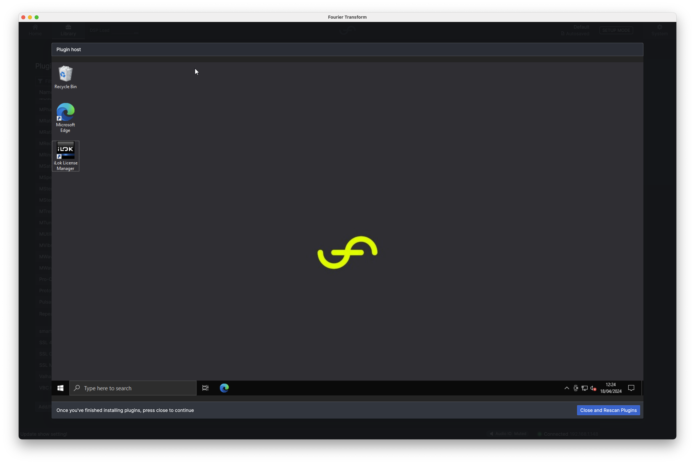

import warningmessage from '../../../../../static/img/transformclient/popup-add-remove.png';

# Installing Plugins

The **transform**.engine hosts all plugins within an isolated Windows 10 environment.

### Accessing the Plugin Host to Install Plugins

To install all plugins on the **transform**.engine, you will need to access the plugin hosting environment that runs in the background.

1. Open the **transform**.client software.
2. Select the **transform**.engine you would like to install the plugins onto.
3. Once open, click the ‘Library’ tab, and select ‘Add/Remove Plugins’.
4. A warning message will appear ‘This will stop the audio engine, are you sure you want to continue?’. If happy to proceed, select ‘Continue to Add/Remove Plugins’.

   

5. Your installed plugins will appear in the list. To add more, select ‘Open plugin host’: this will take you to the plugin host environment.
6. You are now in a position to install your plugins. For manufacturer specific installation processes, click 'Manufacturers' in the sidebar and select the relevant manufacturer.

:::info

The Windows plugin hosting environment does not have access to the internet.

:::

### Leaving the Plugin Host Environment

1. Once you have installed your plugins, you will need to exit the plugin hosting environment: select ‘Close and rescan plugins’. This will return you to the **transform**.client user interface.
2. The plugin scanner will automatically run locate your plugin libraries. Once finished, you’ll see the message ‘Successfully finished scanning, N plugin libraries found.’ Select ‘Finish’ and your plugins will now appear in the ‘Installed Plugins’.
3. Select ‘Close’. This will restart the audio engine and you are ready to add your plugin(s) to chains!
