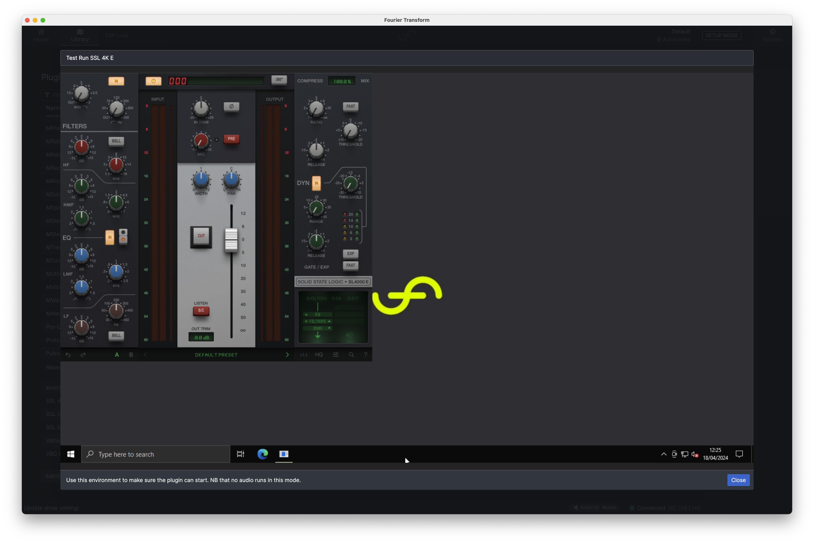

# Test Run

We appreciate that there are many different licensing systems used for plugins. There are also some
features that you may want to access that get disabled when the plugin is processing audio on the
**transform**.engine.

Examples include:

- Open a file dialogue to import presets or licence keys
- Open separate windows that are prohibited by the **transform**.engine while it is processing audio (such as browser windows).
- To use a keyboard with the plugin for text entry.

If you need to test run a plugin in the Windows environment you can do this by navigating to the
Library tab: click 'Add/Remove Plugins', select the plugin you wish to run, and then click the 'Test
Run' button.

This will load an instance of the selected plugin in the Windows environment - enabling you to use it a bit like as if it was running in a normal DAW.

:::tip
Remember! The Windows environment doesn't have access to the internet so you will need to activate your plugin offline.

Also Remember! When in Test Run mode, no audio will be passing through the plugin or your **transform**.engine.
:::
