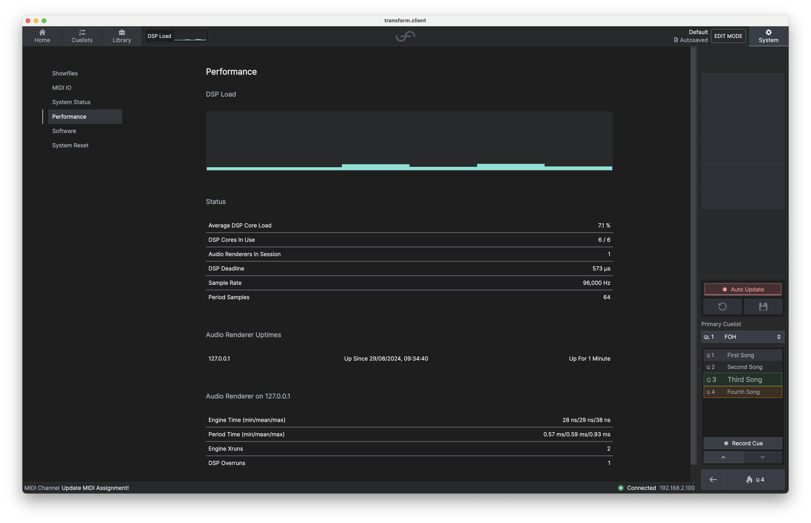

# Performance

If you navigate to the **Performance** tab you will find the current performance metrics for your **transform**.engine.

The chart shown (plus a smaller one in the top left) shows the load per DSP core.

Here you will also find other metrics such as:

- Average DSP Core Load - the average CPU % used across all active cores.
- DSP cores in use - the number of DSP cores currently available in the network, and their maximum
  utilisation.
- DSP Deadline - the time per period available to the system to process audio.
- Sample Rate - configured in Dante Controller, this is the audio sample rate that your **transform**.engine is running at.
- Period Samples - configured in the 'System Status' tab, this is the buffer size your showfile is configured to.

:::tip

By doubling the Period Samples from 32 to 64, you double the latency of the DSP pipeline, but you
also increase the amount of time available (and therefore system capacity) to the chains for
processing.

:::
