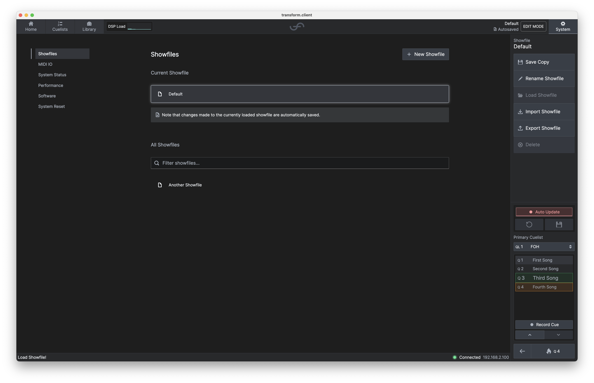

# Showfiles

As the name suggests, showfiles are exactly that, files for your show!

A showfile includes your plugin chain structure, the plugin states, and routing, allowing you to
save your file to a USB stick, take it to your next show, and be ready to go in seconds!

Showfiles do not contain the plugins themselves or any data from the Windows plugin hosting
environment other than the plugin state.

To create a new blank showfile, click 'New Showfile', name it, and you're good to go!

Want to manage your **transform**.engine showfiles? By clicking on a showfile you place it into context, and in the context menu on the right you will find the following options:

- **Save Showfile As** : Like good old Microsoft Word, this will save your current showfile with a new name. You'll then be editing the showfile with the new name.
- **Copy Showfile** : This creates a duplicate of the current showfile, and invite you to name it. You current showfile will not change name.
- **Load Showfile** : Load the selected showfile.
- **Import Showfile** : Got a showfile from another **transform**.engine? Click here and easily import it from your computer.
- **Export Showfile** : Want to take a copy of your current showfile to another **transform**.engine? This is the place to do it.
- **Delete**: Delete the currently selected showfile. You cannot delete your current showfile. That
  would be silly.

:::info

Your loaded showfile does not include the plugin installations (it would make it very large and
messy, quick). Your plugin library, however, will display a hazard sign if the **transform**.engine
doesn't have certain plugins installed from your previous engine. At this point, you can either
install those plugins, or if you're in a rush, smite them!

:::

:::tip

Want to delete your current showfile? Simply create a new one (either using 'New Showfile' or 'Save Showfile As', then select your previous showfile and click 'Delete'.

:::

