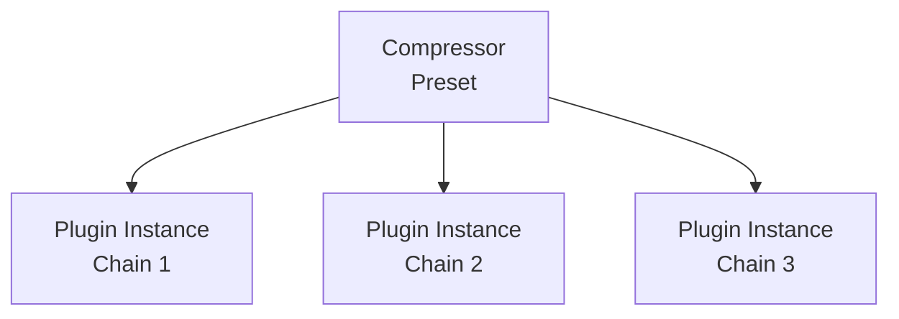
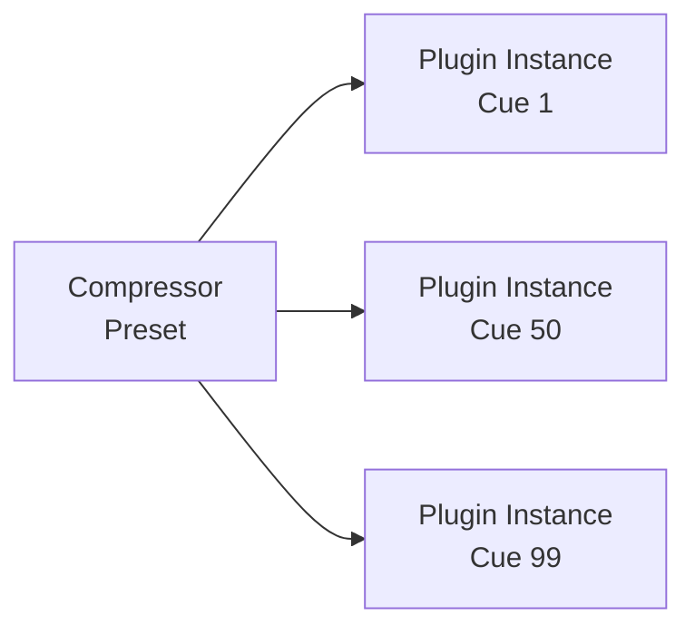

# Presets

Presets are a powerful tool that allow you to save and recall specific plugin configurations across your showfile.

Whilst you can create and update presets directly from the [detail pane](../home/plugin-instances.md)
when you have a plugin instance selected, managing presets once created happens within the **Library** tab.

## Using Presets

A single preset can be used across multiple chains, across multiple cues, or both!

:::info Presets Across Chains
You can point multiple plugin instances to the same preset across different chains.
For example, plugin instances in `Chain 1`, `Chain 2` and `Chain 3` can all use the same compressor preset.
When you update that preset, all three plugin instances reflect the change.

::: 

:::info Presets Across Cues
One plugin instance can use the same compressor preset in `Cue 1`, `Cue 50` and in `Cue 99`.
When you update that preset, the plugin instance reflects the change in all three cues.

:::

## Managing Presets

Within the **Library** tab, when you select a plugin, you’ll find the **Preset Manager**:  

This allows you to:

- **Select a preset** - highlight any preset in the list to make it active.
- **Rename a preset** - change the displayed name to something more meaningful.
- **Import preset** - load a preset previously exported from another showfile.
- **Export preset** - save a presets for backup or transfer.
- **Delete preset** - Remove a preset from the showfile.

## Renaming

You can rename a preset at any time by selecting it in the list and choosing the **Rename** buttons.
{/*  */}

We would strongly recommend giving your presets useful names, to help you remember which preset is which
when you're trying to remember what you were aiming for later on!

## Importing & Exporting

Presets can be exported as standalone files, meaning they can be easily shared between clients or imported into another showfile.

- **Import** - choose a `.state` preset file from your **transform**.client device to add it to your Library.
- **Export** - save the selected preset as a `.state` file for safekeeping or transfer.

{/*  */}

This workflow allows you to maintain a consistent setup across different engines or shows!

## With great power...

As presets reference a single piece of data across your entire showfile, updating a preset impacts **all cues** and **all chains** where that preset is saved. This is powerful for consistency, but also means you can inadvertently change large amounts of plugin instance values all at once.

:::warning
Before modifying a preset, consider its scope:
- **Which cues use this preset?** Changes will apply to all of them.
- **Which chains use this preset?** Changes will ripple across multiple chains simultaneously.
- **Is this the intended behavior?** If you only want to change a preset for a specific cue or chain, consider creating a new preset.
:::

If you don't want a modification to update other places the preset is used,
you can simply create a new preset rather than updating the existing preset.
