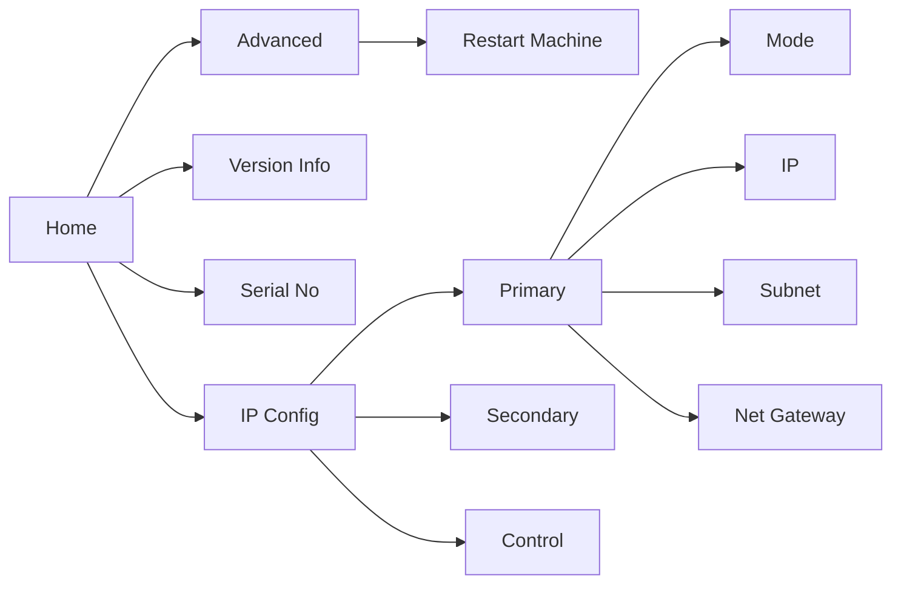

# OLED Display

The handy OLED display on the front informs you of the system status of the unit as well as letting you perform basic configuration of the device.

## Status Display

- **Cable connections**: `pri`, `sec`, `ctl` and `psu` inform you with a handy tick or cross whether a connection is detected on the corresponding that port.
- **System monitor**: if one of the Primary, Secondary or Control networks are connected with a link present, this will display a large **OK** for easier visibility. On the flip side, if none are connected, you'll be presented with the error message **err!**.

:::info

When the **transform**.engine boots it will display **err!** while it loads. This is expected behaviour. Once it says **OK** you'll be good to go.

:::

## Menu

If you push the rotary knob on the front once, you'll enter the transform menu.
The options are:

### IP Configuration
This menu lets you configure the IP address for each network interface.

**Mode:** Each interface can have its IP address configured differently:

* **Static**: Manually configured by you!
* **DHCP**: Receives an IP address from a DHCP server on your network.
* **Link Local**: Automatically configures IP address in the `169.254/16` subnet (or the `172.31/16`
  subnet for the Dante Secondary port).
* **Unconfigured**: When no IP address is needed.

**IP:** In **Static** addressing mode, the IP address you would like the device to use.

**Subnet Prefix:** In **Static** addressing mode, the subnet you would like the device to be on.
Common values are `/24` (equivalent to a mask of `255.255.255.0`) or `/16` (equivalent to a mask of
`255.255.0.0`).

:::warning
When configuring static IP addresses, overlapping subnets are not permitted to ensure reliable network operation. The only exception is for subnets within the `0.0.0.0/8` range, which are allowed to overlap. This enables initial setup using the front panel default (`0.0.0.0/24`). Once configuration is complete, ensure all interfaces use unique subnets outside this range.
:::

**Net Gateway:** In **Static** addressing mode, optionally, the IP address of a
gateway host to use to reach other subnets. This is not usually needed and can
be set to `No` (default) to communicate only on the configured subnet.

### Version Info
What version of the **transform**.engine software this hardware is running.

### Serial Number
A magic code you can use to obtain drinks tokens at any Fourier Audio event. Only joking.

### Advanced
**Restart Machine**: For when you've had enough. As it suggests, when confirmed, this will restart your **transform**.engine.

We apologise if you have found an error and needed to restart; if you have the time, please send an
email to [support@fourieraudio.com](mailto:support@fourieraudio.com). We would love to avoid this
happening again!
